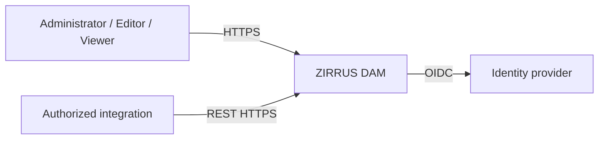
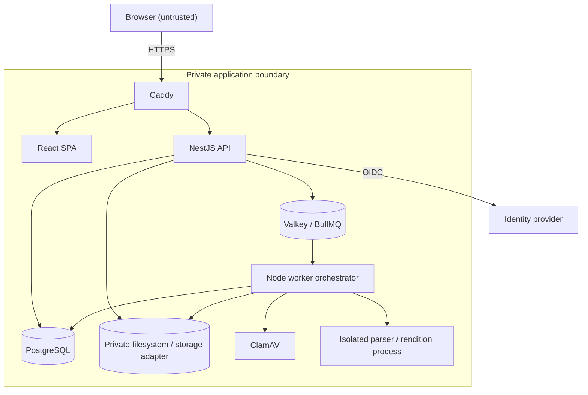
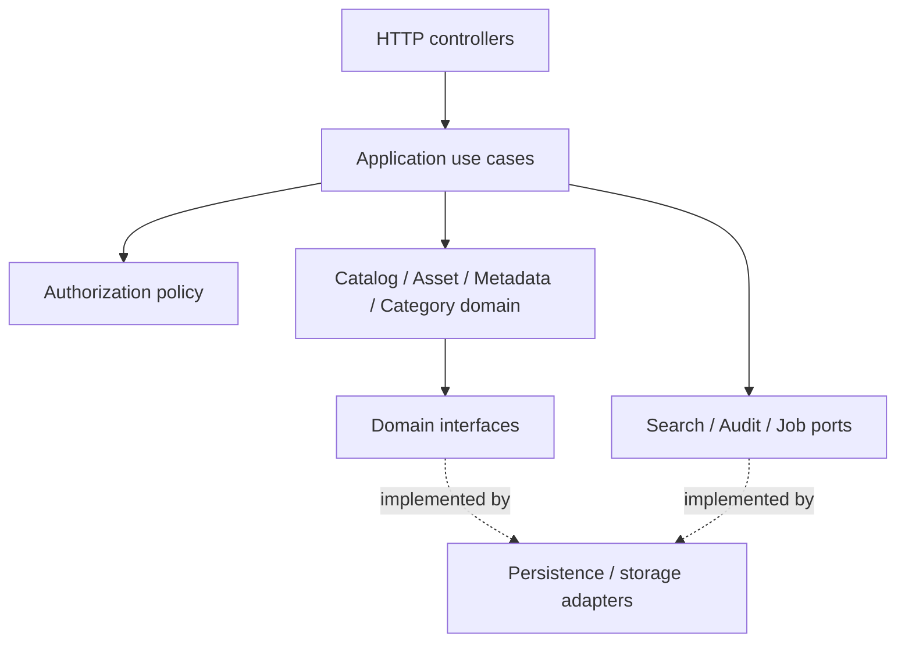

# C4-style system views
Proposed; issue #3.

## Context

```mermaid
flowchart LR
  U["Administrator / Editor / Viewer"] -->|HTTPS| Z["ZIRRUS DAM"]
  Z -->|OIDC| I["Identity provider"]
  X["Authorized integration"] -->|REST HTTPS| Z
```
## Containers

```mermaid
flowchart TB
  B["Browser (untrusted)"] -->|HTTPS| C["Caddy"]
  subgraph Private["Private application boundary"]
    C --> W["React SPA"]
    C --> A["NestJS API"]
    A --> P[("PostgreSQL")]
    A --> S[("Private filesystem / storage adapter")]
    A --> Q[("Valkey / BullMQ")]
    Q --> J["Node worker orchestrator"]
    J --> P
    J --> S
    J --> K["ClamAV"]
    J --> T["Isolated parser / rendition process"]
  end
  A -->|OIDC| I["Identity provider"]
```
## API components

```mermaid
flowchart TD
  H["HTTP controllers"] --> U["Application use cases"]
  U --> Z["Authorization policy"]
  U --> D["Catalog / Asset / Metadata / Category domain"]
  U --> R["Search / Audit / Job ports"]
  D --> P["Domain interfaces"]
  P -. implemented by .-> I["Persistence / storage adapters"]
  R -. implemented by .-> I
```
