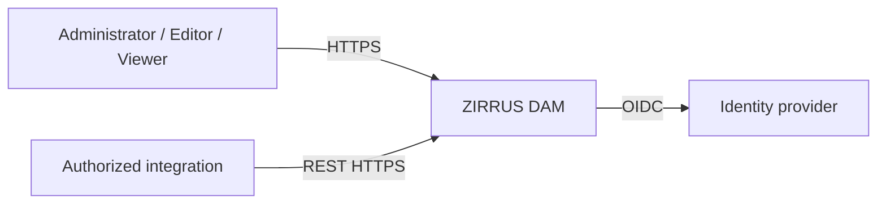
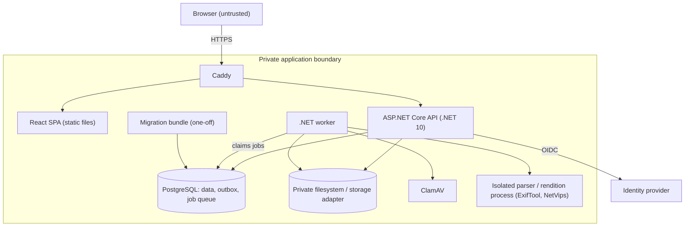
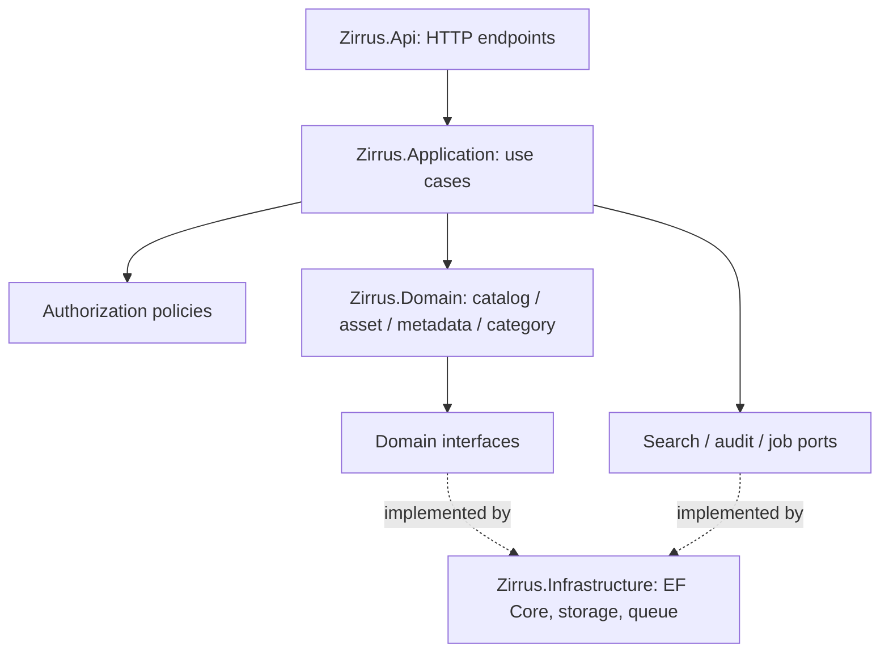

# C4-style system views
Proposed; issue #3. Backend: ASP.NET Core / .NET 10 ([ADR 0001](../adr/0001-core-stack.md)).

## Context

```mermaid
flowchart LR
  U["Administrator / Editor / Viewer"] -->|HTTPS| Z["ZIRRUS DAM"]
  Z -->|OIDC| I["Identity provider"]
  X["Authorized integration"] -->|REST HTTPS| Z
```
## Containers

```mermaid
flowchart TB
  B["Browser (untrusted)"] -->|HTTPS| C["Caddy"]
  subgraph Private["Private application boundary"]
    C --> W["React SPA (static files)"]
    C --> A["ASP.NET Core API (.NET 10)"]
    A --> P[("PostgreSQL: data, outbox, job queue")]
    A --> S[("Private filesystem / storage adapter")]
    J[".NET worker"] -->|claims jobs| P
    J --> S
    J --> K["ClamAV"]
    J --> T["Isolated parser / rendition process (ExifTool, NetVips)"]
    M["Migration bundle (one-off)"] --> P
  end
  A -->|OIDC| I["Identity provider"]
```
## API components

```mermaid
flowchart TD
  H["Zirrus.Api: HTTP endpoints"] --> U["Zirrus.Application: use cases"]
  U --> Z["Authorization policies"]
  U --> D["Zirrus.Domain: catalog / asset / metadata / category"]
  U --> R["Search / audit / job ports"]
  D --> P["Domain interfaces"]
  P -. implemented by .-> I["Zirrus.Infrastructure: EF Core, storage, queue"]
  R -. implemented by .-> I
```
